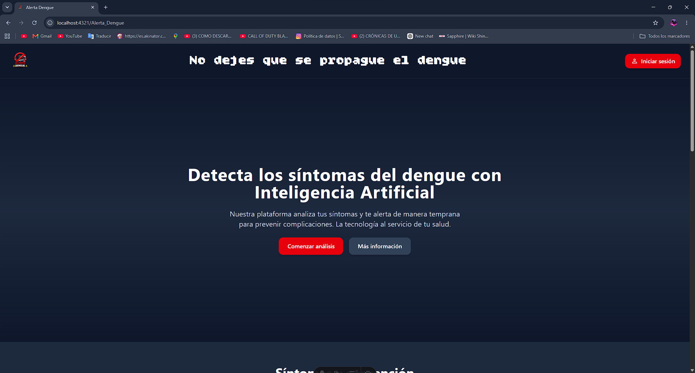
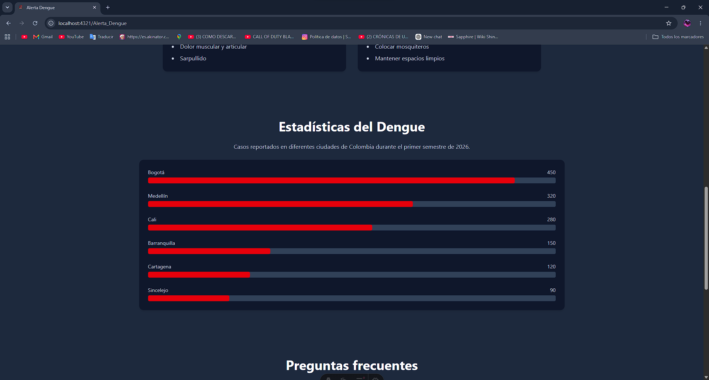
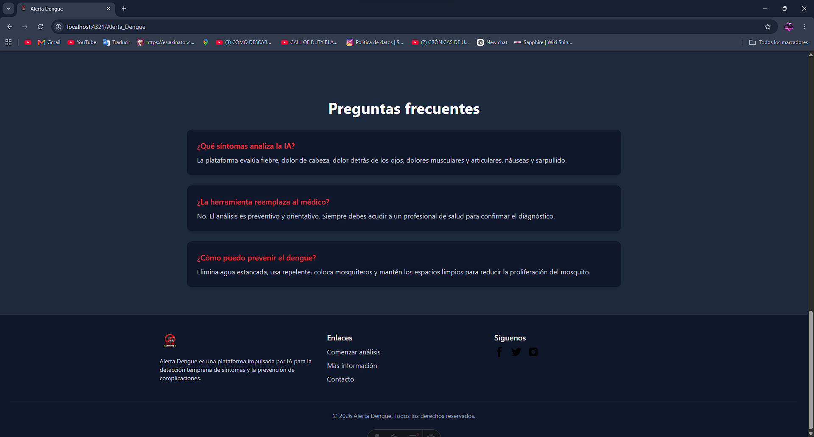
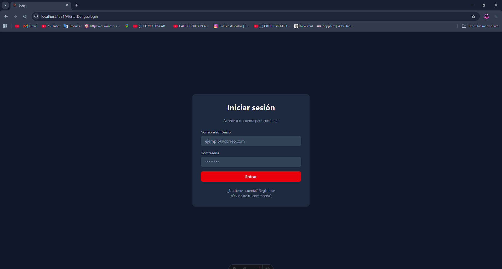

# 🦟 Alerta Dengue

<p align="center">
  
  
  
  
</p>


---

## 📌 Descripción

**Alerta Dengue** es una plataforma web desarrollada con **Astro** y **TailwindCSS** que utiliza **Inteligencia Artificial** para la detección temprana de síntomas relacionados con el dengue.  
El objetivo es brindar a los usuarios una herramienta preventiva que les permita identificar señales de alerta y tomar decisiones informadas para proteger su salud.

---

## 🎯 Propósito

- Detectar síntomas comunes del dengue mediante un sistema asistido por IA.  
- Educar a la población sobre **prevención y cuidados**.  
- Mostrar **estadísticas estáticas** y visuales sobre casos reportados.  
- Ofrecer una experiencia moderna, rápida y responsiva gracias a Astro y TailwindCSS.  

---

## 🛠️ Tecnologías utilizadas

- **[Astro](https://astro.build/)** (última versión) → Framework moderno para sitios estáticos y rápidos.  
- **[TailwindCSS](https://tailwindcss.com/)** (última versión) → Estilos utilitarios para un diseño limpio y responsivo.  
- **[Node.js](https://nodejs.org/)** → v24.15.0  
- **[pnpm](https://pnpm.io/)** → v11.7.0, gestor de paquetes eficiente y rápido.  

---

## 🚀 Instalación y uso

1. Clona el repositorio:
   ```bash
   git clone https://github.com/tu-usuario/alerta-dengue.git
   cd alerta-dengue

2. Instala dependencias
   ```bash
   pnpm install

3. Ejecutar Servidor de Desarrollo
   ```bash
   pnpm dev

## 📸 Capturas de pantalla

<p align="center">
  
</p>

<p align="center">
  
</p>

<p align="center">
  
</p>

<p align="center">
  
</p>

<p align="center">
  
</p>
